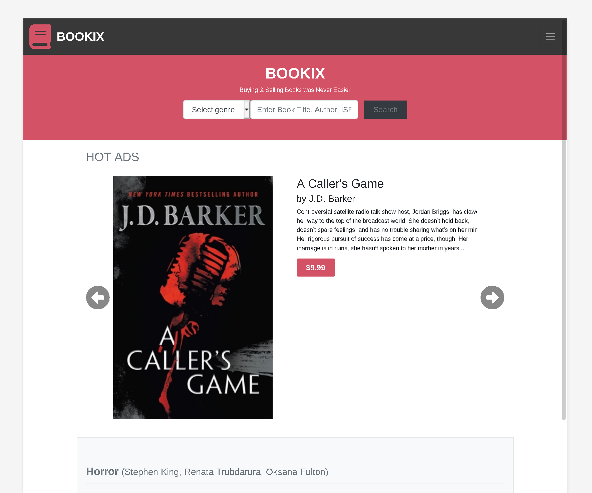

# Capstone Project - Bookix - Online Book Store

> This is my capstone project for Microverse's Module 1 - HTML & CSS.
> It is Online Books Store built on Bootstrap.

Project is built on Bootstrap 4.3.1 and uses SASS as its CSS extension.

## Built With

- Sass
- Bootstrap 4.2.1
- HTML/CSS

## Live Demo

[Live Demo Link](https://zilton7.github.io/online-shop/)

## Getting Started

**Since project uses Bootstrap CDN you don't need anything, just download and extract files. As for Sass part you might need
to download some Sass addon for your text editor. ie for VSCode I use 'Live Sass Compiler' **

## Authors

👤 **Zil Norvilis**

- GitHub: [@zilton7](https://github.com/zilton7)
- Twitter: [@devnor7](https://twitter.com/devnor7)
- LinkedIn: [zil-norvilis](https://www.linkedin.com/in/zil-norvilis)

## 🤝 Contributing

Contributions, issues, and feature requests are welcome!

Feel free to check the [issues page](issues/).

## Show your support

Give a ⭐️ if you like this project!

## Acknowledgments

- Hat tip to anyone whose code was used
- Inspiration
- etc

## 📝 License

This project is [MIT](lic.url) licensed.
