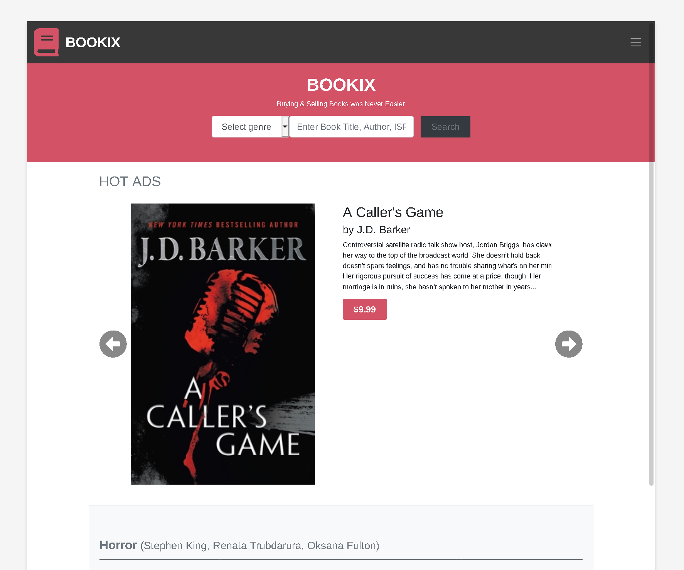

# Capstone Project - Bookix - Online Book Store

This design was built with online books stores in mind. It consists of 2 pages. The main page and the search result page.

## Built With

- Sass
- Bootstrap 4.2.1
- HTML/CSS

## Live Demo

[Live Demo Link](https://zilton7.github.io/online-shop/)

## Getting Started

**Since project uses Bootstrap CDN you don't need anything, just download and extract files. As for Sass part you might need
to download some Sass addon for your text editor. ie for VSCode I use 'Live Sass Compiler' **

## Authors

👤 **Zil Norvilis**

- GitHub: [@zilton7](https://github.com/zilton7)
- Twitter: [@devnor7](https://twitter.com/devnor7)
- LinkedIn: [zil-norvilis](https://www.linkedin.com/in/zil-norvilis)

## 🤝 Contributing

Contributions, issues, and feature requests are welcome!

Feel free to check the [issues page](issues/).

## Show your support

Give a ⭐️ if you like this project!

## Acknowledgments

- Design idea by [Mathew Njuguna and others on Behance](https://www.behance.net/M_Awad)
- Base layout: [link](https://www.behance.net/gallery/24796463/ZATTIX)

## 📝 License

This project is [MIT](lic.url) licensed.
